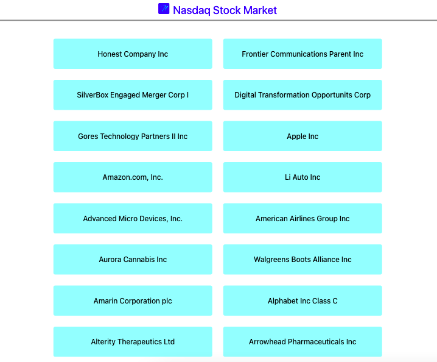
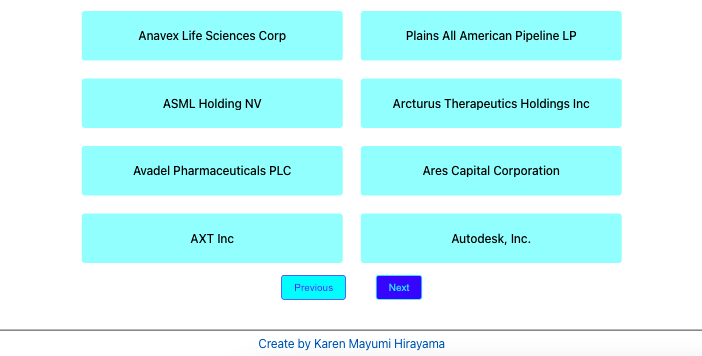
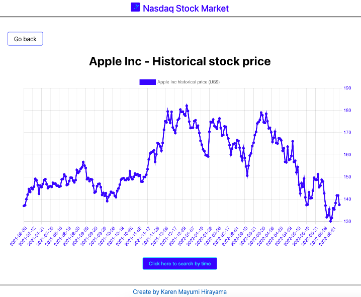
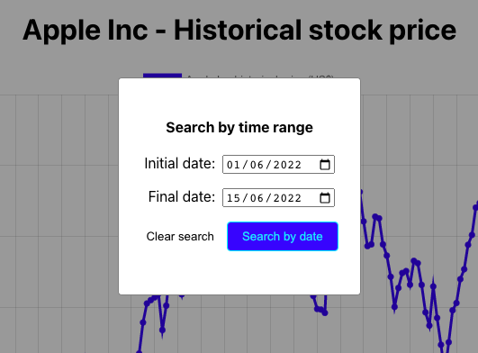
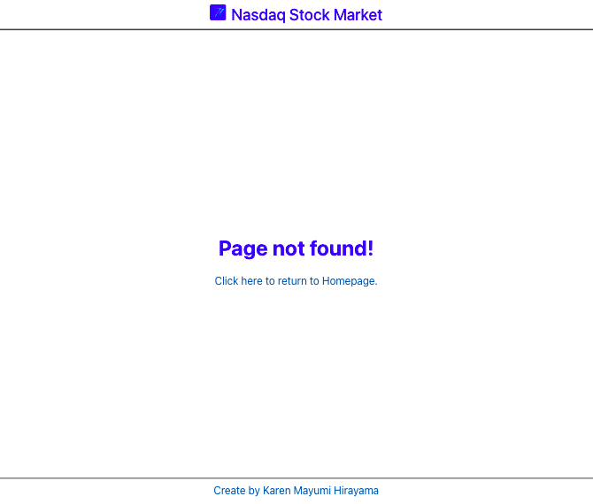
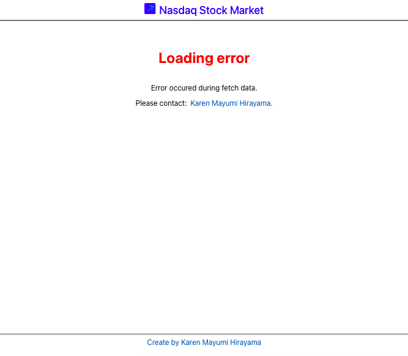

# NASDAQ STOCK HISTORICAL PRICE 

The project is build with [STOCKDATA.ORG](https://www.stockdata.org/) to display the informations.

## Tecnologies

This project is build with:

[ReactJS](https://pt-br.reactjs.org/)
[Axios](https://axios-http.com/docs/intro)
[React-Router-Dom](https://v5.reactrouter.com/web/guides/quick-start)
[React-ChartJS-2](https://react-chartjs-2.js.org/)

## User Story

A user can view the list of all companies listed in the NASDAQ stock marked, also can see a historical price of a specify stock.
### Homepage

</img>
</img>

The homepage has a list of all companies listed in the NASDAQ stock marked.

### Historical price

</img>

The page displays the historical price of the stock.

If you want to search by a specify range time, click in the button "Click here to search by time", and this action open a modal with the inputs.

</img>

### Not found page

</img>

If the user try to go to a page that doesn't exist, the user will be directed to a Not Found page.

### Error in fetch data

</img>

If the fetch data fails or the search in the API fails, the user will be directed to a not found page.

## Start the application

To run the application, first make sure you have [npm](https://www.npmjs.com/) or [yarn](https://yarnpkg.com/). The follow steps are with yarn, but it works with npm.

### `yarn install`

Run in the terminal `yarn install` to install `node-modules`.

### `yarn start`

After run in the terminal `yarn start`, and open [http://localhost:3000](http://localhost:3000) to view it in the browser.